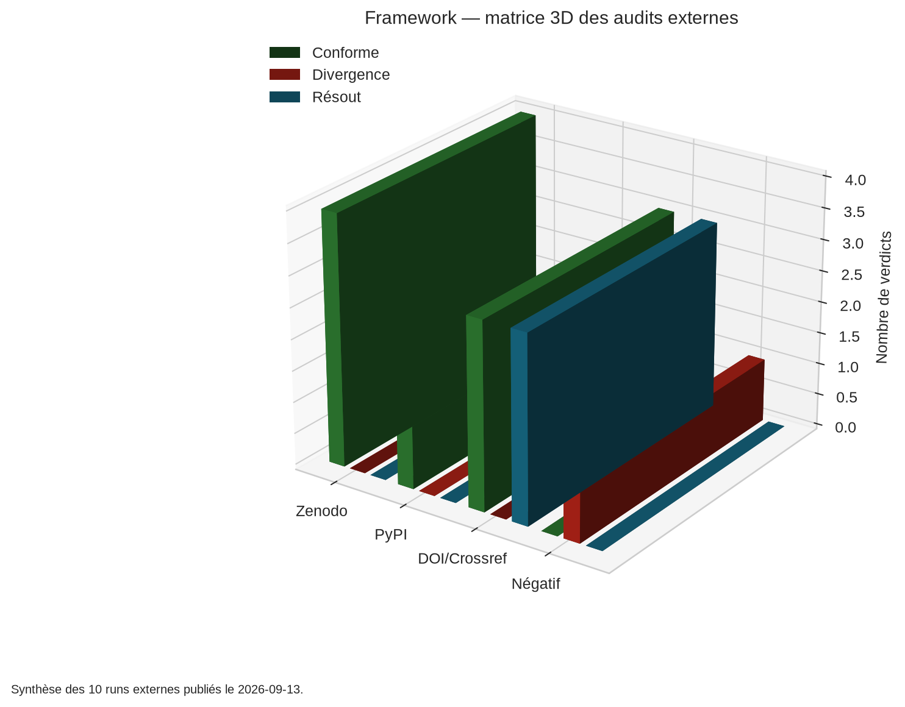
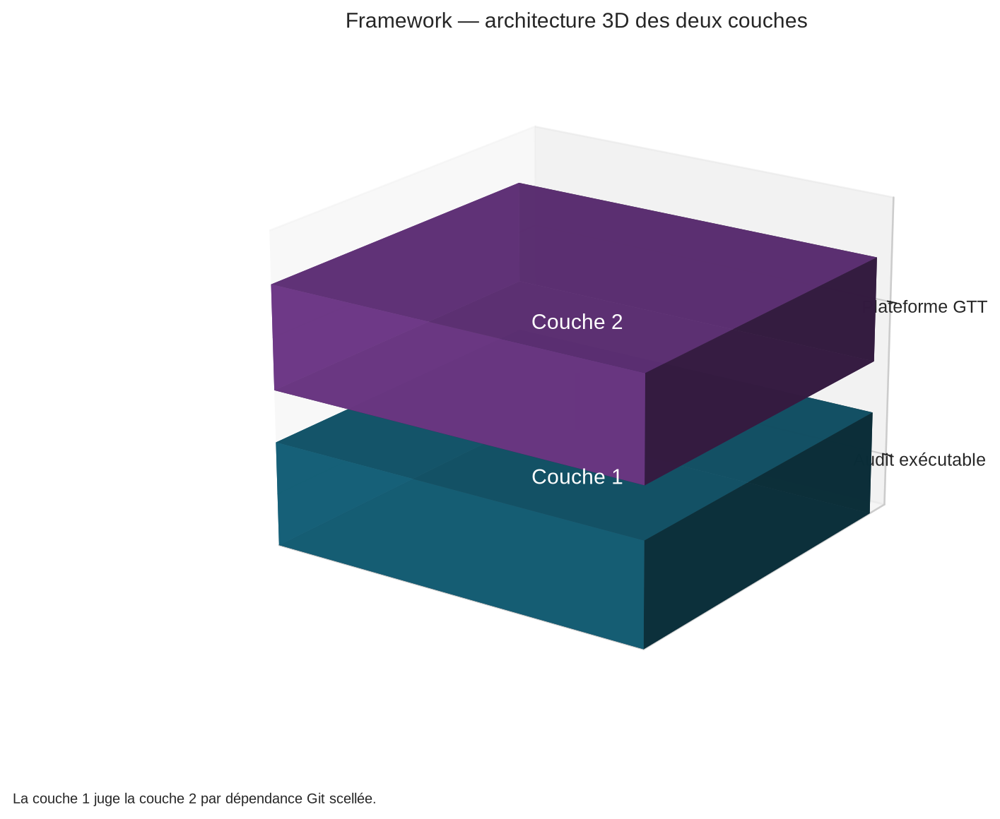
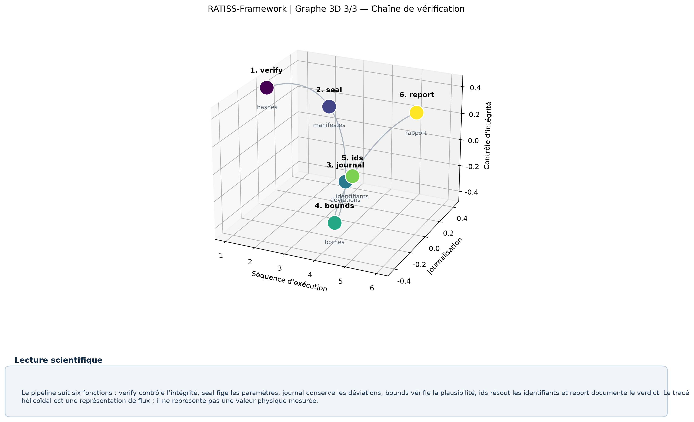

# RATISS-Framework

## Executable scientific audit protocol

[](https://github.com/jonathansearch/RATISS-Framework/actions/workflows/tests.yml)
   

> **RATISS-Framework** is the method and control layer of RATISS Labs. It provides an audit protocol executable in standard Python, based on sealed hashes, chained deviation journals, physical plausibility bounds, identifier resolution and a single command to replay the published verdicts.


---

## 1. Positioning

RATISS-Framework turns scientific integrity requirements into executable controls. The repository does not replace scientific expertise and does not declare a result true by mere technical compliance. It rather verifies that the announced elements are identifiable, sealed, replayable and correctly documented.

The framework constitutes **layer 1** of the RATISS Labs ecosystem. It notably judges the [RATISS-LABS-GTT](https://github.com/jonathansearch/RATISS-LABS-GTT) repository, which constitutes the experimental layer 2. This dependency is sealed and verified in continuous integration.

> **Rule R7:** no public claim without a third party being able to reproduce it in one command.

The project uses exclusively the Python standard library for its critical path. This constraint reduces the number of dependencies needed for the audit and makes reproduction easier in controlled environments.

## 2. Executive summary

RATISS-Framework gathers six central functions: hash integrity verification, manifest sealing, chained deviation journal, physical plausibility bounds evaluation, identifier resolution and generation of audit reports with no empty sections.

The protocol separates the construction of an artifact from its evaluation. The creation team can produce, modify and test the components. The Red team then applies the judge and keeps a veto right over publication. A result compliant with the protocol is therefore a documented, verifiable and replayable result within the announced scope; it does not automatically constitute an independent scientific validation.

## 3. Laboratory and governance

**RATISS Labs** is an independent laboratory based in Yaoundé, Cameroon. The laboratory audits public research artifacts by verifying their hashes, their identifiers, their physical plausibility and their reproducibility. Every report is published with a reproduction annex.

Jonathan Evina is founder and laboratory chief. His ORCID identifier is [0009-0000-4092-5313](https://orcid.org/0009-0000-4092-5313) and his reference GitHub account is [jonathansearch](https://github.com/jonathansearch).

The laboratory operates with two distinct responsibilities:

| Function | Responsibility | Publication authority |
|---|---|---|
| Creation | construction, execution and preparation of artifacts | no publication authority |
| Red team | independent verification, certification or divergence statement | absolute veto |

The auditor keeps priority over the laboratory chief whenever a gap is detected. This rule aims to prevent a schedule or presentation imperative from replacing a verification.

For audit requests, the associated public repository is [`ratiss-audit-public`](https://github.com/jonathansearch/ratiss-audit-public). The professional contact is `jonathan.ratisslabs@zohomail.com`.

## 4. The method and its rules

The method rests on a single operational law: a published number or claim must be attached to a computation, to parameters and to a proof of reproduction.

| Rule | Operational statement |
|---|---|
| **R4** | Conceptual reasoning is always allowed; a number is published only if it has been computed with its parameters and its hash. |
| **R5** | Prompts and parameters are sealed and hashed in every run; any modification after measurement becomes a journaled deviation. |
| **R6** | Experimental arms are separated from the critical path; the verdict rests on an ablation with and without the modification, never on an intuition. |
| **R7** | No public claim is published without a third party being able to reproduce it in one command. |
| **R8** | We only measure what overflows the script: an instrument only counts the part of the signal that the setup does not impose itself ("the instrument of the remainder"), validated by a control without perturbation whose floor is quasi zero. |
| Inherited 1 | A simulation is not a hardware execution. |
| Inherited 2 | A registered identifier is not a real-time revalidation. |

These rules are transcribed into the `verify`, `seal`, `journal`, `bounds`, `ids`, `report`, `residual` (R8) and `__main__` modules.

## 5. Technical components


### `verify` — integrity and shapes

The `verify` module compares a served artifact to an expected hash and verifies the shapes needed for the audit. It allows attaching a published value to bytes actually received rather than to a mere address or an availability promise.

### `seal` — sealed manifests

The `seal` module builds and verifies the manifests. Sealing makes the parameters controllable before execution and allows detecting a modification that occurred after the measurement.

### `journal` — chained deviations

The `journal` module keeps deviations in a verifiable chain. Each event is written in continuity with the previous one so that the order and integrity of the history can be controlled.

### `bounds` — physical plausibility

The `bounds` module applies bounds checks. It notably includes the Tsirelson bound and verifies that an announced value stays within the domain expected by the declared physical contract.

### `ids` — persistent identifiers

The `ids` module resolves DOIs and other registered identifiers. It distinguishes an existing identifier from a real-time revalidation of the associated content.

### `report` — complete reports

The `report` module generates structured audit reports. An empty section or an undocumented element must not be confused with a validation.

### `__main__` — execution command

The `__main__` entry point gathers the controls to offer a reproducible and explicit interface.

## 6. Command-line usage

The following commands illustrate the main controls:

```bash
python -m ratiss audit --url <url> --sha256 <hash>     # integrity of a served artifact
python -m ratiss audit-zenodo --record <id> --file <f> # published checksum vs served bytes
python -m ratiss doi <doi>                             # identifier resolution (Inherited 2)
python -m ratiss chsh <value>                          # Tsirelson bound |S| ≤ 2√2
```

The parameters must be declared before execution. The produced values are then associated with the corresponding manifests, journals and receipts.

## 7. Architecture of the RATISS ecosystem

The ecosystem rests on two complementary products:

- **Layer 1 — RATISS-Framework:** executable audit protocol, judge, sealing, provenance and reports.
- **Layer 2 — RATISS-LABS-GTT:** experimental platform in nine layers dedicated to topology, world models, simulation and visualizations.

Layer 1 judges layer 2. This direction is a technical governance element: GTT's results must be replayable and evaluable by a mechanism distinct from the layer that produces them.

Artifacts that do not enter the main chain are not erased by default. They are frozen, dated and documented in the provenance and orphans mechanisms.

## 8. State of RATISS-LABS-GTT


### Three Framework 3D visualizations







> These 3D graphics present the documented structure and results of the protocol. They create no new scientific measurement.

As of **2026-09-13**, the two layers are operational. The judge analyzes GTT in continuous integration at every push through a sealed Git dependency, using manifests compared against `SEALS.json`.

| GTT element | Value | Verification |
|---|---:|---|
| Built phases | 1–7 (Red relay disclosed, auditor ⏳ PENDING) | GTT's `docs/AUDIT_TRAIL.md` |
| Tests | 108 passed, standard library only | CI `gtt.yml` |
| Judge of this repository | exit 0 on GTT | CI job `judge` |
| Real external run LeWM/TwoRooms | delta **0.626131533384**, APPROVED | byte-identical GTT certification |
| Independent replay | one-command kit provided | GTT's `docs/AUDIT-INDEPENDANT-KIT.md` |

This repository's method claims nothing about GTT that GTT cannot replay. This constraint is the contract between the two products.

## 9. Proof of concept — 10 external runs

The proof of concept of **2026-09-13** covers several categories of controls:

| Platform | Targets | Verdicts |
|---|---|---:|
| Zenodo | 4 served files compared to published md5 checksums, including a chemistry paper from **1856** | 4 COMPLIANT |
| PyPI | `openai` and `requests` wheels compared to published sha256 digests | 2 COMPLIANT |
| DOI / Crossref | 3 real identifiers with verified resolution | 3 RESOLVES |
| Negative control | `openai` digest applied to the `requests` wheel | **1 DIVERGENCE DETECTED** |

The negative control is indispensable. A method that only knows how to produce compliant results does not allow distinguishing an effective verification from an always-permissive mechanism.

The special millennial run of **2026-09-13** examines the OpenAI Navier–Stokes claim. The paper is sealed, the Lean repository is sealed at the commit and the Clay registry is consulted. No resolution is awarded. The competing preprints are not reachable by stable identifier. The details are in [`proofs/POC-MILLENAIRE-2026-09-13.md`](proofs/POC-MILLENAIRE-2026-09-13.md), and the full scope in [`proofs/POC-EXTERNAL-AUDITS-2026-09-13.md`](proofs/POC-EXTERNAL-AUDITS-2026-09-13.md).

## 10. Installation and reproduction

The repository requires Python **>=3.9** and needs no external dependency for the offline tests.

```bash
git clone https://github.com/jonathansearch/RATISS-Framework.git
cd RATISS-Framework
python3 -m pytest -q                 # 47 offline tests, stdlib only
python3 -m pytest -q --run-network   # + 4 tagged network tests
bash proofs/replay_poc.sh            # the 10 external runs, one command
```

The network tests must be executed in an environment allowing outgoing connections. The results must be interpreted with the associated journals and reports, and not as a general guarantee independent of the execution context.

## 11. Provenance and traceability

Each module carries its provenance line in [`audit/PROVENANCE.md`](audit/PROVENANCE.md). This line specifies the source repository, the source commit, the possible existence of a rewrite or a copy and the named auditor.

A module without provenance is rejected. A pre-filled auditor is also rejected: the value stays **PENDING** until the Red team's visa according to rule N2.

The deviation journal is kept in [`audit/journal-deviations.jsonl`](audit/journal-deviations.jsonl). Sample reports are available in [`examples/`](examples/) and replay proofs in [`proofs/`](proofs/).

## 12. Interpretation of verdicts

A **COMPLIANT** verdict means that the defined control has been executed and that the artifact satisfies the announced technical contract for that control. It does not mean that all possible scientific properties of the artifact are established.

A **RESOLVES** verdict means that the identifier has been resolved according to the intended mechanism. It does not mean that the content has been experimentally revalidated.

A **DIVERGENCE** is a useful result. It indicates that the received artifact does not match the expected hash or condition. Keeping it in the report protects the integrity of the process.

## 13. License and citation

The project is distributed under the MIT license. Copyright (c) **2026 Jonathan Evina, RATISS Labs**. See [`LICENSE`](LICENSE) for the full text and [`CITATION.cff`](CITATION.cff) for the citation metadata.

## References

[1]: https://github.com/jonathansearch/RATISS-Framework "RATISS-Framework — executable scientific audit protocol"
[2]: https://github.com/jonathansearch/RATISS-LABS-GTT "RATISS-LABS-GTT — main experimental platform"
[3]: https://orcid.org/0009-0000-4092-5313 "ORCID of Jonathan Evina"

---

**The credibility of a result also depends on the ability to document its limits, its gaps and its reproduction conditions.**
